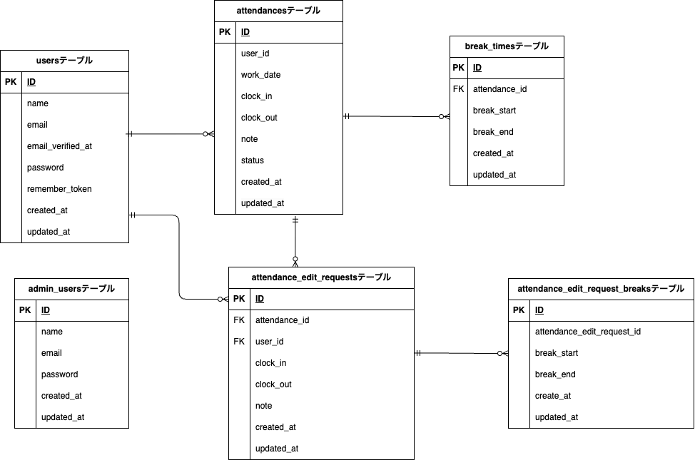

# coachtech 勤怠管理アプリ

## 環境構築

### Dockerのビルド
1. リポジトリをクローン  
   ```bash
   git clone git@github.com:kazyuaki/contact-form-test.git
   ```
2. コンテナをビルド&起動
  - `docker-compose up -d --build`

3. ストレージリンク 
  - `php artisan storage:link`

4. キャッシュをクリア
  - `php artisan config:clear`
  - `php artisan cache:clear`
        
  ※MySQL は、OS によって起動しない場合があるので、それぞれの PC に合わせて.  `docker-compose.yml` ファイルを編集してください

#### Laravel 環境構築
1. コンテナに入る
  - `docker-compose exec php bash`

2. 依存パッケージをインストール
  - `composer install`

3. 環境変数ファイルをコピー
  - `cp .env.example .env` 

4. アプリケーションキーを生成
  - `php artisan key:generate`

5. マイグレーション
  - `php artisan migrate`

6. シーディング
  - `php artisan db:seed`

#### メール認証(Mailhogを使用)

##### .env のメール設定
```bash
MAIL_MAILER=smtp
MAIL_HOST=mailhog
MAIL_PORT=1025
MAIL_USERNAME=null
MAIL_PASSWORD=null
MAIL_ENCRYPTION=null
MAIL_FROM_ADDRESS=null
MAIL_FROM_NAME="${APP_NAME}"
```

##### メール認証の流れ
1.	ユーザー登録
http://localhost/register から新規登録すると、未認証ユーザーとして作成されます。
2.	認証メール送信
ユーザー作成時に「メールアドレス確認」通知が自動送信されます。
MailHog（http://localhost:8025）
を開き、件名「Verify Email Address」のメールを確認します。
3.	認証リンクをクリック
メール本文のリンク（/email/verify/{id}/{hash}?...）をクリックすると認証完了。
認証後は 勤怠登録画面 にリダイレクトされます


#### ログイン情報

||メールアドレス|パスワード|
| --- | --- | --- |
|一般ユーザー| user&#8203;@example.com |password|
|管理者ユーザー| admin&#8203;@example.com|password|


## PHPUnitを利用したテストに関して(.env.testing推奨)
1. `env.testing`を作成
```env
APP_ENV=testing
DB_CONNECTION=mysql
DB_HOST=mysql
DB_PORT=3306
DB_DATABASE=laravel_db_test
DB_USERNAME=laravel_user
DB_PASSWORD=laravel_pass
MAIL_MAILER=array
CACHE_DRIVER=array
QUEUE_CONNECTION=sync
SESSION_DRIVER=array
```

2. テスト用データベースの作成
```bash
docker-compose exec mysql bash
mysql -u root -p
# パスワードは root
CREATE DATABASE laravel_db_test;
exit;
```

3. マイグレーション
- `docker-compose exec php bash`
- `php artisan migrate:fresh --env=testing`

4. テスト実行
- `docker-compose exec php bash`
- `./vendor/bin/phpunit`


## 使用技術(実行環境)
- 言語
  - PHP 8.4.5
- フレームワーク
  - Laravel 8.x
- サーバー環境
  - MySQL 8.4.4
  - nginx 1.21.1

## ER 図


#### カーディナリティ
| 記号       | 意味                |
| ---------- | ------------------- |
| &#124;     | ちょうど1（必須1）  |
| o&#124;    | 0 または 1（任意1） |
| &lt;       | 多（複数）          |
| o&lt;      | 0 個以上（任意多）  |
| &#124;&lt; | 1 個以上（必須多）  |

#### 主な関係
  → ユーザーは複数の勤怠を持つ（Attendance は必ず1つの User に属する）
- `attendances 1 ─< attendance_breaks`  
  → 勤怠に休憩が0件または複数つく
- `users 1 ─< attendance_edit_requests`  
  → ユーザーは複数の修正申請を出せる
- `attendances 1 ─< attendance_edit_requests`  
  → 1つの勤怠に対して申請が0件または複数あり得る
- `attendance_edit_requests 1 ─< edit_request_breaks`  
  → 修正申請にも休憩修正行が0件または複数つく


## URL
- 管理者画面: http://localhost/admin/login
- 一般ユーザー画面: http://localhost/login 
- メール認証(Mailhog): http://localhost:8025
- phpMyAdmin(DB確認用): http://localhost:8080
